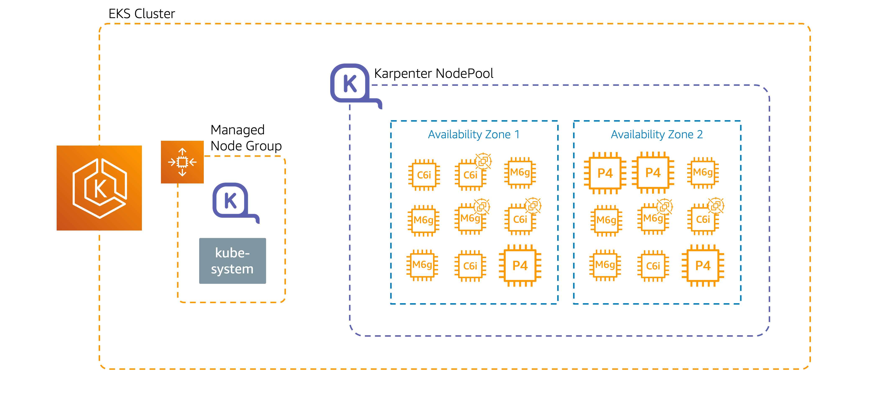

**Terraform Code: Building an EKS Cluster for GenAI**

These Terraform scripts automate the creation of an Amazon EKS (Elastic Kubernetes Service) cluster designed for optimal cost and performance. Here's a breakdown:

***Part 1: Setting the Stage***

* **Provider Configurations:**  Establishes connections with AWS, EKS, and other tools (like Helm for Kubernetes deployments) using API keys for secure access.
* **Data Source:** Configure information like available server locations (Availability Zones), authentication tokens, and details from an existing Virtual Private Cloud (VPC). 

***Part 2: The EKS Cluster and Karpenter***

* **EKS Cluster Creation:** The code defines and launches an EKS cluster with specific settings:
    * **Security:**  Configures firewalls (security groups) and user permissions.
    * **Networking:**  Connects the cluster to your VPC for communication with other resources.
    * **Node Groups:** Sets up managed node group (2x m5.xlarge EC2) to run your applications, including essential system components like EKS-Addon.
* **Karpenter AddOn:**  The code prepares your cluster for Karpenter, a powerful tool that:
    * **Right-Sizes Your Cluster:**  Karpenter automatically adds or removes EC2 based on your applications' exact resource needs (CPU, memory, GPU etc.) We will use Karpenter to spin up GPU instances to host our GenAI application and LLM.
    * **Saves You Money:** By using the most cost-effective server types (including spot instances), Karpenter optimizes your spending on cloud resources.



**Note**:
we are using EC2 spot as part of Karpenter nodepools. if this is the first time you are using EC2 spot do create the service link role
```
aws iam create-service-linked-role --aws-service-name spot.amazonaws.com
```

**Terraform IaC to setup the environment.**

```sh
terraform init
terraform apply --auto-approve

```
***Validate your EKS setup***
```

kubectl get nodepool          #validate that you have 2 karpenter nodepools
NAME                NODECLASS
g5-gpu-karpenter    g5-gpu-karpenter
x86-cpu-karpenter   x86-cpu-karpenter
```

**HuggingFace**


we will be using Meta Llama 3 LLM for our workshop.

Meta developed and released the Meta Llama 3 family of large language models (LLMs), a collection of pretrained and instruction tuned generative text models in 8 and 70B sizes. The Llama 3 instruction tuned models are optimized for dialogue use cases and outperform many of the available open source chat models on common industry benchmarks.  

Create a Huggingface account and then create a **READ** access token (https://huggingface.co/settings/tokens). We will need to keep this access token in EKS kubernetes secret `hf-secret`, so that we can download llama3 LLM from huggingface.
You will also need to visit https://huggingface.co/meta-llama/Meta-Llama-3-8B-Instruct to agree to META LLAMA 3 COMMUNITY LICENSE AGREEMENT.

```sh
kubectl create secret generic hf-secret \
    --from-literal=key=hf-secret \
    --from-literal=hf_api_token=XXXX
```


**Hosting LLM on Amazon EKS**

vLLM (https://docs.vllm.ai/en/latest/) is an open-source library designed for high-throughput inference and serving of large language models (LLMs) like Meta's Llama 3. It achieves this through a novel memory allocation technique called PagedAttention, which minimizes wasted memory in the LLM's attention mechanism. While existing systems can waste 60-80% of the key-value cache (KV cache), vLLM reduces this to under 4%, allowing it to run models with up to 24x higher throughput than HuggingFace Transformers. 

vLLM provides an OpenAI-compatible API, meaning you can interact with a locally hosted LLM using the familiar OpenAI client libraries and API calls. This makes it easy to integrate with existing applications or tools (eg: Langchain) designed for OpenAI's services.

The size of an LLM's parameter count directly impacts the GPU memory required for inference. Larger models with more parameters need significantly more GPU memory. vLLM's efficient memory management, through PagedAttention, helps alleviate this constraint to some extent, allowing you to run larger models on less powerful GPUs compared to other solutions.  However, as model size increases, more powerful GPUs are generally required to maintain acceptable performance. 

**hosting Llam 3 inference on vLLM**


The Kubernetes `eht-vllm-llama3.yaml` manifest consists of two main parts: a Deployment and a Service. Let's break it down:

***Deployment***:

* Creates a single replica of a pod running the vLLM inference server.
* Uses the container image `vllm/vllm-openai:v0.5.0.post1`.
* Requests and limits 1 NVIDIA GPU for the container that will host Llama-3-8B. This will trigger Karpenter to request for a G5 EC2 node.
* Sets various arguments for the vLLM server, including the model ID, data type, and GPU memory utilization.
* Uses environment variables to set the model ID (`Meta-Llama-3-8B-Instruct`) and port (`8000`).
* Mounts a shared memory volume for efficient inter-process communication. This is not needed for single gpu, but vLLM supports multiple-gpu for larger models.

***Service***:

* Exposes the vLLM server as a LoadBalancer service.
* Maps port 80 of the load balancer to port 8000 of the vLLM server.
* Uses annotations to configure an AWS Network Load Balancer (NLB) that's internet-facing.


```sh

kubectl apply -f eht-vllm-llama3.yaml

```
Install eks-node-viewer (https://github.com/awslabs/eks-node-viewer) to visualize Karpenter spinning up a new EC2 with GPU.


Now, let's visualize this setup with an architecture diagram:

```
TBD
```

vLLM on Kubernetes Architecture Diagram
Click to open image
This architecture diagram illustrates the key components of the vLLM deployment on Kubernetes:

The outermost box represents the Kubernetes cluster.
Inside the cluster, we have a node with a GPU.
The node runs a pod containing the vLLM inference server container.
The container is configured with the specified model (`Meta-Llama-3-8B-Instruct`) and listens on port 8000. When vLLM container starts, it will use the huggingface token `hf-secret` and download the model from Huggingface.
An AWS Network Load Balancer sits in front of the Kubernetes cluster, routing external traffic to the vLLM service.
The service is accessible from the internet, allowing clients to send requests to the LLM model.


