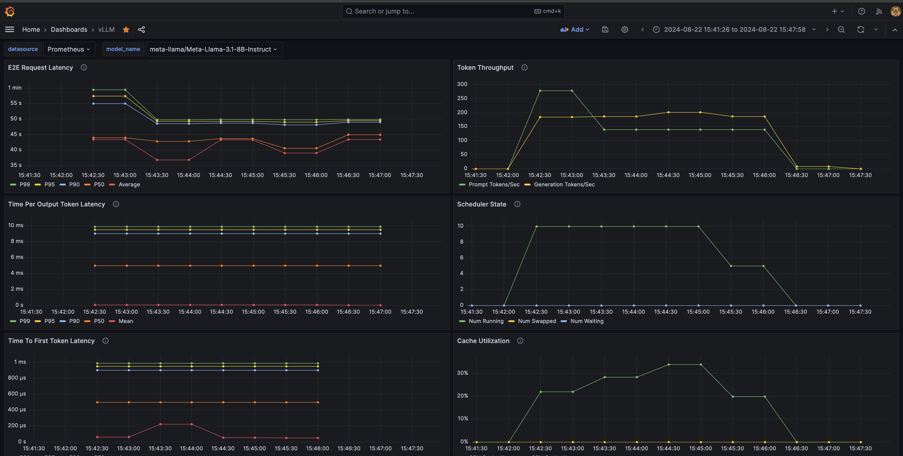
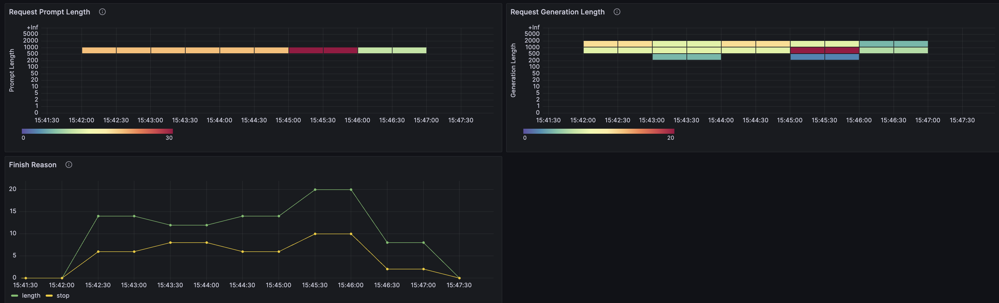

  ## Obserbability with Prometheus and Grafana

  ```
  1- Grafana port-forward `kubectl port-forward svc/kube-prometheus-stack-grafana 8080:80 -n kube-prometheus-stack`
  2- Grafana Admin user: admin
  3- Get sexret name from Terrafrom output: `terraform output grafana_secret_name`
  4- Get admin user password: `aws secretsmanager get-secret-value --secret-id <REPLACE_WIRTH_SECRET_ID> --region $AWS_REGION --query "SecretString" --output text`


browse to http://localhost:8080/

```

1. add "grafana/vllm-dashboard.json" to grafana dashboard.
2. enable prometheus to scrap vllm
edit 
https://github.com/enghwa/pinnipeds/blob/f207447725045432ac40aca2f1fe8653bfed4749/helm-values/kube-prometheus.yaml#L19 
uncomment vllm portion and update accordingly.

Note: In vllm, Prometheus metric logging is enabled by default in the OpenAI-compatible server. Inside EKS, if you have a kubernetes service called `vllm-service` in the `default` namespace, its metric endpoint will be `vllm-service.default.svc`





reference:
https://github.com/vllm-project/vllm/tree/main/examples/production_monitoring
